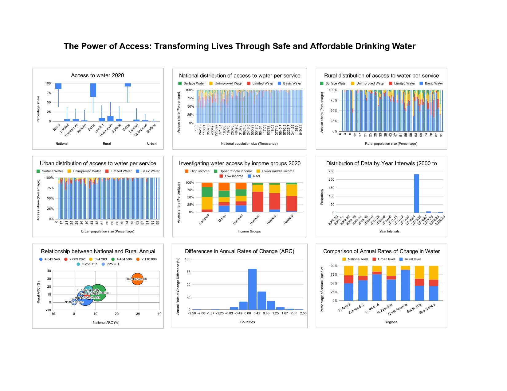

# Access to Safe and Affordable Drinking Water

## Project Overview

Once upon a time, I embarked on a journey to tackle the global challenge of providing safe and affordable drinking water. This comprehensive project aimed to understand and transform the data related to access to drinking water.

## Part 1: Understanding Access to Water

In the first part of the project, I delved into the dataset, exploring various aspects of access to water. I discovered that the estimated world urban population size in 2020 had a percentage difference of 1.70% compared to the dataset. This highlighted the importance of accurate data in understanding the scale of the challenge.

Through visualizations and analysis, I debunked misconceptions and uncovered insights about access to water across different income groups and population sizes. I found that the distribution of access to basic water services varied across income groups, and countries with greater urban population shares were more likely to provide basic water service.

## Part 2: Transforming the Data and Analyzing Trends

In the second part of the project, I focused on the year representation and annual rates of change. I analyzed the dataset's time range and observed the distribution of annual rates of change for rural and urban areas. I found that more countries had higher rates of change in rural areas, indicating the need for targeted interventions in these regions.

Analyzing regional differences, I discovered that Sub-Saharan Africa saw the greatest improvement in access to basic water services on a national level. This highlighted the importance of addressing regional disparities and implementing sustainable solutions.

## Dashboard Display

Above is a visual representation of the project's findings, displayed in the dashboard format. The dashboard provides a comprehensive overview of access to safe and affordable drinking water, showcasing the insights gained from the data analysis.

## Conclusion

This project serves as a reminder that access to clean water is a fundamental human right. By understanding the challenges, analyzing trends, and implementing targeted interventions, we can work towards a sustainable future where everyone has access to safe and affordable drinking water.